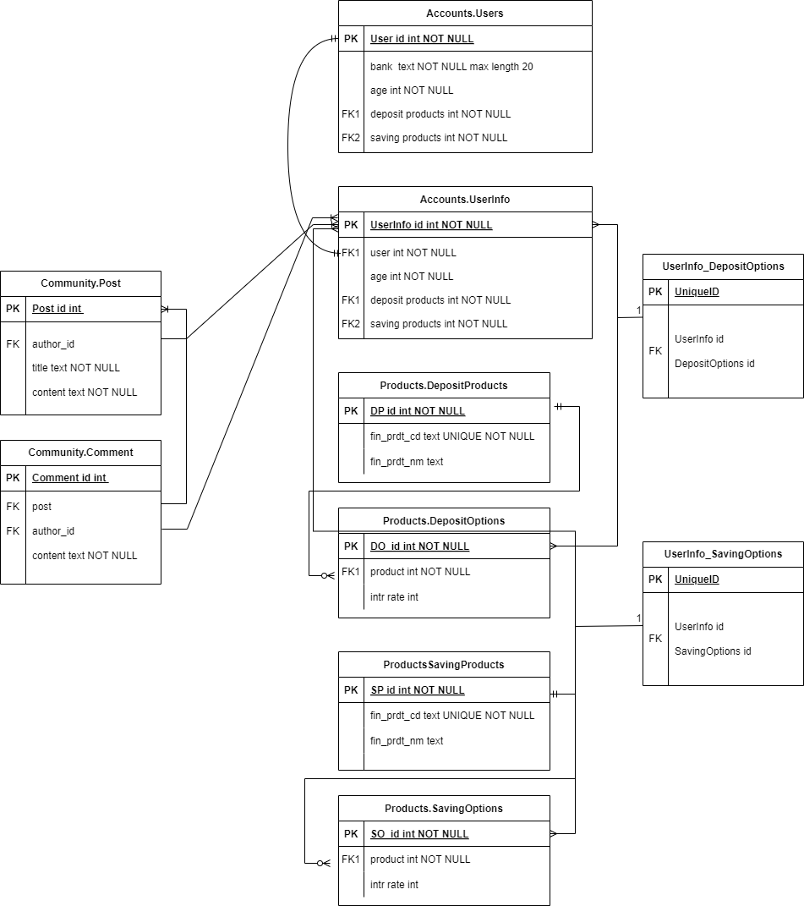
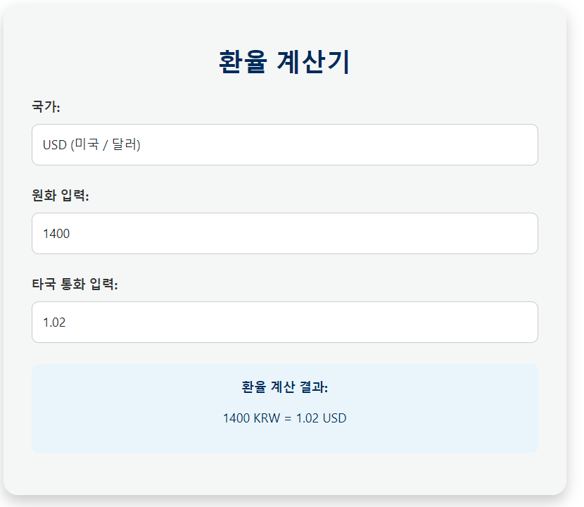
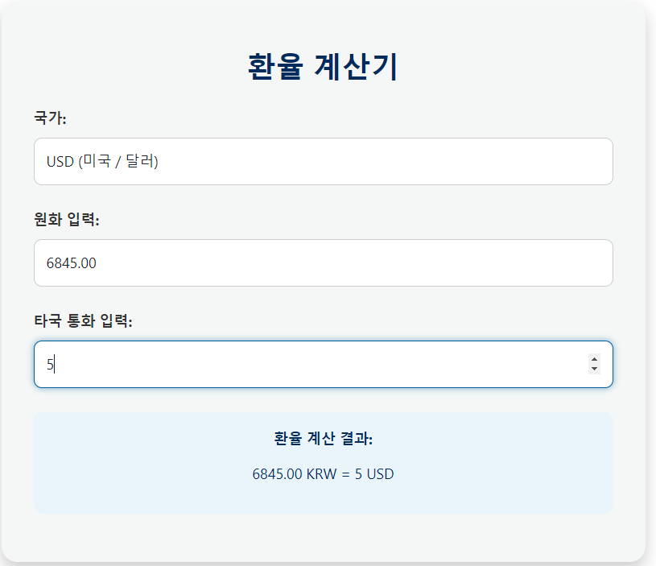
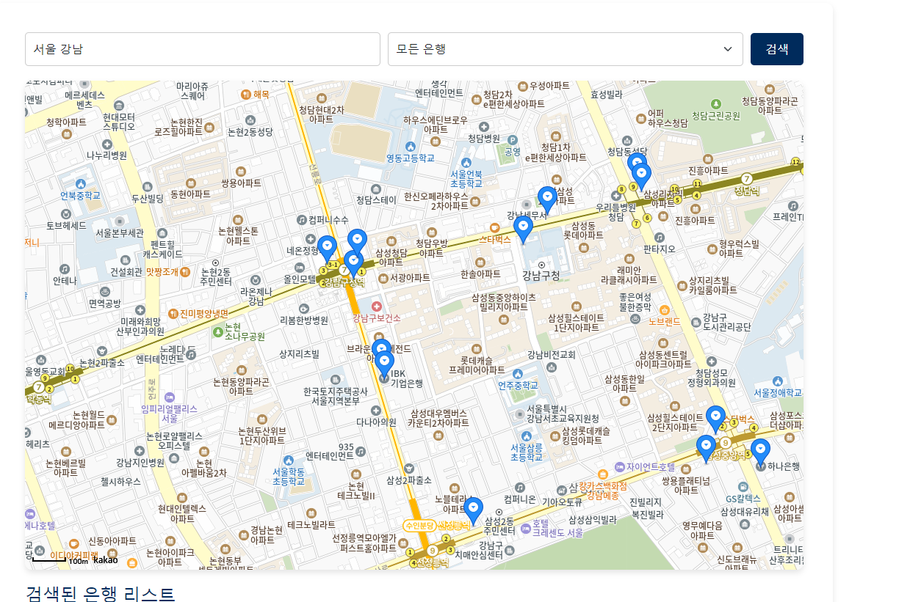
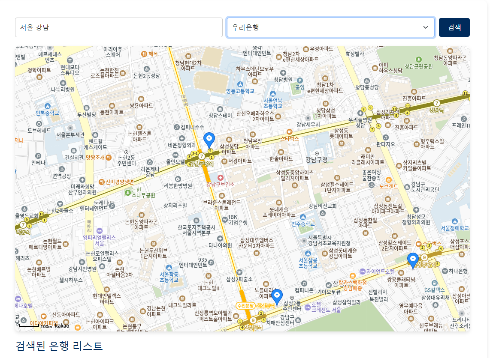
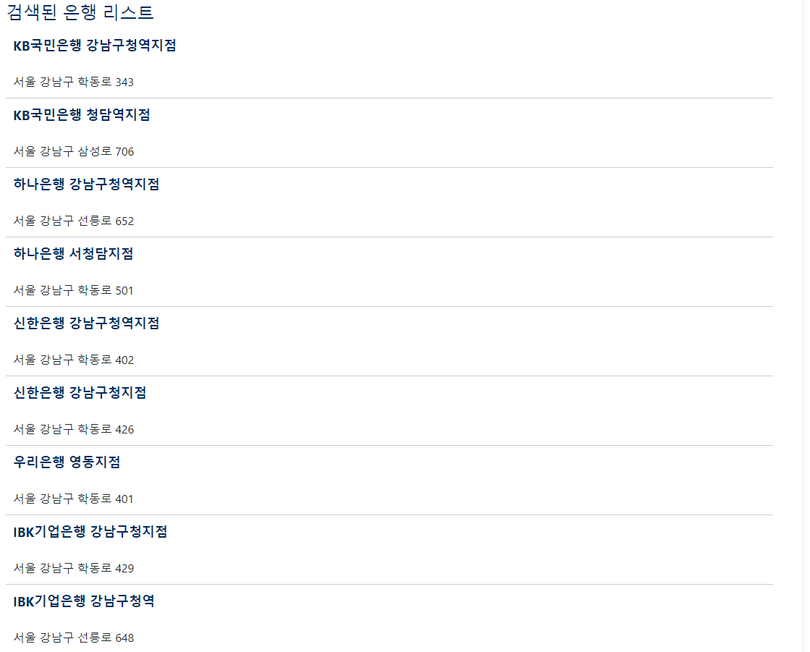
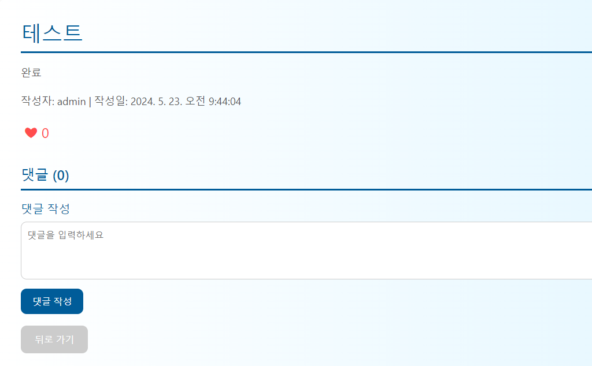

# 관통 프로젝트(주제: 금융)

## TEAM 북박박

* 팀장: 박준영
* 팀원: 박기현

---

## 팀원 소개

### 박준영

* Frontend(vue) 총괄
  * store에 products, user 기초 함수 정리
  * Axios를 이용한 비동기 요청 처리
  * Component, View 세팅
* User, UserInfo 테이블 분리 및 정보 저장
* 카카오맵 API 이식
* 상품 추천 알고리즘 고안
* ERD 그리기
* 프레젠테이션

### 박기현

* Backend(Django) 총괄
  * App별 url 구축
  * views의 authorization, api method 정리
  * Serializer, Model 구축
* 페이지 디자인
  * 웹 로고 제작
  * AI 기반 앱 이미지 제작
  * 메인 테마 디자인
* 카카오맵 API를 이용한 은행 필터링, 마커 추가
* 환율 계산 API를 이용해 양방향으로 계산 가능한 환율 계산기 구현
* OpenAI API를 이용한 챗봇 구현, 추천 알고리즘 이식

---

 

# 기획 단계

## 프로젝트 구조

### 장고 백엔드

### Vue 프론트엔드

### ERD 다이어그램

* Accounts 앱
  1. Django Auth에서 제공하는 User정보가 담긴 User 모델
  2. User의 부가적인 정보를 담은, User와 1:1 관계의 UserInfo 모델
  3. UserInfo와 Products app의 예금, 적금 옵션과 연결된 M:N 관계의 2개 모델
   
* Products 앱
  1. 금융감독원 API로 수집한 예금, 적금 모델
  2. 각 예금 적금의 옵션을 담은 1:N관계의 Options 모델 2개
  
* Community 앱
  1. 게시판의 글을 저장하고, 작성자를 User에서 Foreign key로 사용하는 Post 모델
  2. 게시판의 댓글을 저장하고, Post와 1:N인 Comment 모델
  3. 각 Post, Comment와 User간 M:N의 좋아요 모델
  
* Exchange 앱
  * 환율을 API에서 가져와서 저장하는 ExchangeRate 모델

 

## 프로젝트 주요 기능 소개

### 양방향 환율 계산기

* 입력 즉시 계산이 완료된 결과를 템플릿에 로딩해주는 계산기

* 원화를 타국 화폐로

* 타국 화폐를 원화로

---

### 카카오맵을 이용한 은행 검색

* 지역을 입력하면, 지역 내의 은행을 검색

* 이후 원하는 은행을 필터링 가능

* 검색된 지역의 은행 목록을 표기

---

### 이용자 게시판

* 로그인한 사용자가 아니면 내비게이션 가드를 이용해 접근 거부

* 좋아요 버튼과 댓글은 비동기로 즉각적으로 보여짐

---

## 프로젝트 후기

> ### 박기현
> 한 마디로 요약하자면 쉽지 않은 여정이었다.
 
> 일정상 면접 준비와 프로젝트 진행을 동시에 해야 했기에 시간은 항상 촉박했다.
 
> 기능을 수행하는 과정에서 오류 없이 깔끔하게 실행되는 경우가 드물어서 디버깅에도 많은 시간을 할애해야 했다.
 
> 프로젝트의 백미인 챗봇 부분에서는 외부 API를 이용하다보니, 여러가지 내부 함수를 이해하고 조정하는 것이 힘들었다.
 
> 하지만 힘들기만 한 것은 아니었다. 팀원과 서로의 강점을 살리며 하나 하나 해결하는 성취감은 물론이고,
 
> 1학기의 나 자신을 돌아보며 내가 쌓아온 SW적 역량을 실감할 수 있었다.